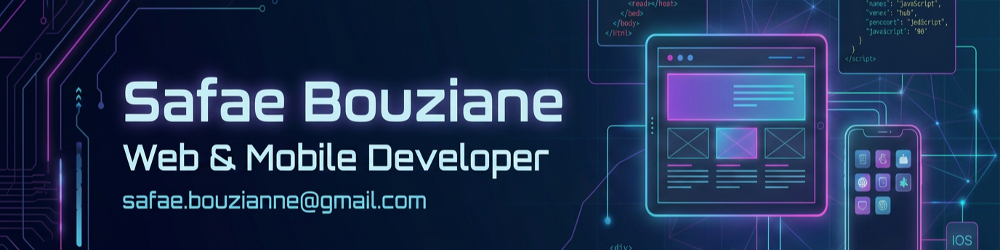

<!--
**safaebouzianne-gif/safaebouzianne-gif** is a ✨ _special_ ✨ repository because its `README.md` (this file) appears on your GitHub profile.

Here are some ideas to get you started:

- 🔭 I’m currently working on ...
- 🌱 I’m currently learning ...
- 👯 I’m looking to collaborate on ...
- 🤔 I’m looking for help with ...
- 💬 Ask me about ...
- 📫 How to reach me: ...
- 😄 Pronouns: ...
- ⚡ Fun fact: ...
-->
<!-- ===================================================== -->

<!--                    HEADER BANNER                       -->

<!-- ===================================================== -->

  

<h1 align="center">👋 Hello, I'm Safae Bouziane!</h1>

  <b>💻 Full-Stack Developer • 📱 Web & Mobile Developer • 🤖 AI Enthusiast</b>

  🇲🇦 Morocco &nbsp;•&nbsp; 🎓 Master's degree &nbsp;•&nbsp; 🚀 Software Developer

  
  

---

# 👩‍💻 About Me

I'm a passionate **Full-Stack Web & Mobile Developer** from Morocco 🇲🇦,
interested in building modern, scalable and intelligent digital solutions.

🎓 Master's student in Computer Science
💻 Full-Stack Web Development
📱 Web & Mobile Application Development
🤖 Artificial Intelligence & Intelligent Applications
🗄️ Database Design & Management
🔐 Secure API Development

I enjoy transforming ideas into complete digital products — from **database
design and backend APIs to modern web/mobile interfaces and deployment.**

---

# 🛠️ Tech Stack

## 💻 Programming Languages

  
  
  
  
  

## 🎨 Frontend

  
  
  
  
  
  
  

## ⚙️ Backend

  
  
  
  

## 📱 Mobile Development

  
  
  

## 🗄️ Databases

  
  
  
  

## 🔐 APIs & Authentication

  
  
  

## 🤖 AI & Real-Time

  
  
  

## ☁️ DevOps & Tools

  
  
  
  
  
  
  

---

# 🏆 Certifications & Badges

## 🎓 Cisco Networking Academy

  <b>CSS Essentials</b> •
  <b>Python Essentials 2</b> •
  <b>English for IT 1</b>

  <a href="https://www.credly.com/badges/e73791c4-731c-4401-a277-b211bee74b73/public_url">🔗 CSS Essentials</a>
  •
  <a href="https://www.credly.com/badges/6037be57-011c-497e-bb53-e1ae05bba31f/public_url">🔗 Python Essentials 2</a>
  •
  <a href="https://www.credly.com/badges/9339b73b-068a-4b4b-81ee-3712a8ffa66b/public_url">🔗 English for IT 1</a>

---

# 🚀 Featured Projects

## 🏥 ShifaTech — Healthcare Super App

A digital healthcare platform designed to connect **patients, doctors,
pharmacies and healthcare services** in one ecosystem.

### ✨ Key Features

* 👨‍⚕️ Doctor management
* 📅 Appointment booking
* 📹 Video consultations
* 💊 Pharmacy integration
* 🏠 Home healthcare services
* 📋 Medical records
* 🤖 AI-powered symptom analysis
* 🔐 Secure authentication

**Tech Stack**

`Laravel` `React` `React Native` `Supabase` `OpenAI` `Agora` `JWT`

---

## 💊 Sapharma

A pharmacy/parapharmacy management solution designed to manage products,
inventory and users.

### ✨ Key Features

📦 Stock Management
🧾 Product Management
👥 User Management
📊 Dashboard
📱 Mobile Application

**Tech Stack**

`React.js` `Laravel` `Flutter` `MySQL`

---

# 🎓 Education & Training

### 🎓 Master's Degree — Computer Science

Focused on software engineering, information systems, databases,
web/mobile development and artificial intelligence.

### 💻 JobInTech — Web & Mobile Development

Professional training focused on modern web and mobile application
development.

---

# 💼 Professional Experience

### 👩‍💻 Medyouin — Internship

Web and software development experience in a professional environment,
working on practical development tasks and application development.

### 👩‍💻 YouNetwork — Internship

Practical experience in web and software development.

---

# 🌍 Languages

🇲🇦 **Arabic** — Native
🇫🇷 **French** — Professional
🇬🇧 **English** — Professional

---

# 📊 GitHub Analytics

---

# 🔥 GitHub Streak

---

# 📫 Let's Connect

---

⭐ <b>Thanks for visiting my profile!</b> ⭐

 

💡 <i>Building ideas into digital solutions.</i>

